# 🚀 VM Setup and Environment Initialization Guide

This guide provides step-by-step instructions to spin up a GCP VM instance with:

- ✅ **2 vCPUs**
- ✅ **10GB HDD**
- ✅ **4GB RAM**

This environment is suitable for running **Dagster**, **Python**, and **DBT**.

> ⚠️ **Note:** Your local project structure must match exactly to avoid issues.

---

## 🧭 Step-by-Step Instructions

### 🔹 Step 1: Launch Compute Engine
In the GCP Console, search for **Compute**:  
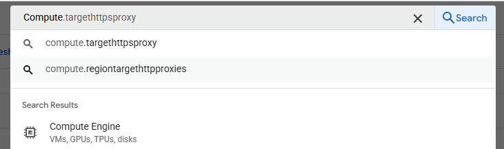

### 🔹 Step 2: Open Compute Engine
Select **Compute Engine**:  
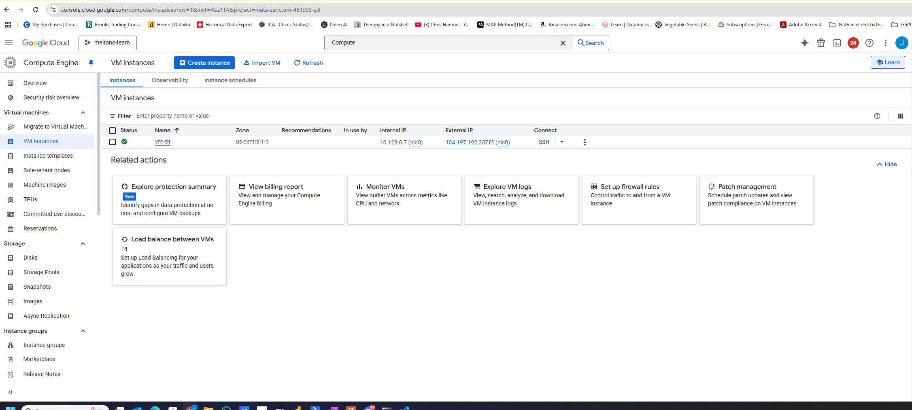

### 🔹 Step 3: Access the Dashboard
You’ll land on the Compute Engine dashboard:  
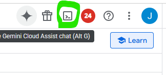

### 🔹 Step 4: Launch Google Cloud Shell
Click the **Cloud Shell** icon on the top-right:  
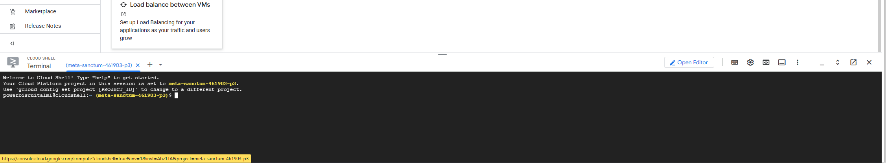

### 🔹 Step 5: Wait for Cloud Shell to Load
Cloud Shell is launched:  
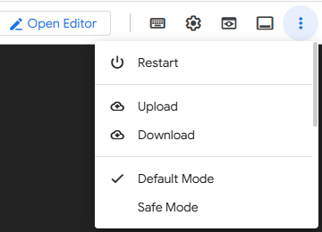

---

### 🔹 Step 6: Upload Setup Script
Upload `create-vm.sh` from the `IAC` folder to the terminal:  
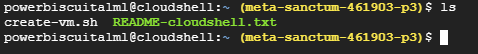

### 🔹 Step 7: Check for Upload
Use `ls` to verify the upload. The file should appear in white:  
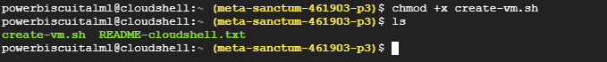

### 🔹 Step 8: Make Executable
Run the following to make it executable:
```bash
chmod +x create-vm.sh
ls
```
File should now be green:  
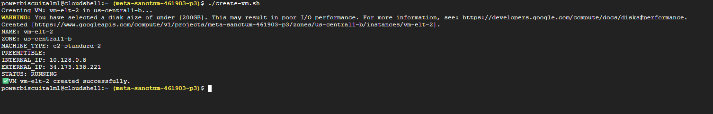

### 🔹 Step 9: Run the Script
```bash
./create-vm.sh
```
Ignore the disk size warning:  
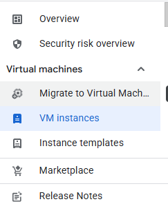

### 🔹 Step 10: Refresh VM Console
Click **VM Instances** to view the VM:  
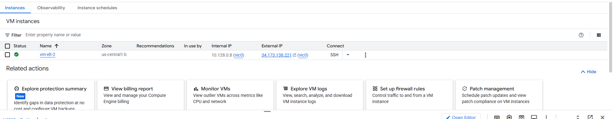

### 🔹 Step 11: Confirm VM Creation
Check for a VM named `vm-etl-2`:  
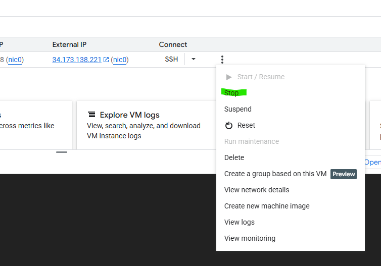

---

### 🔹 Step 12 (Optional): Stop VM to Prevent Charges
Click the 3 dots → **Stop VM** if you're not continuing:  
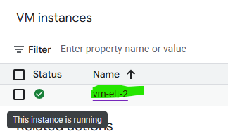

### 🔹 Step 13: Open VM
Click on the created VM:  
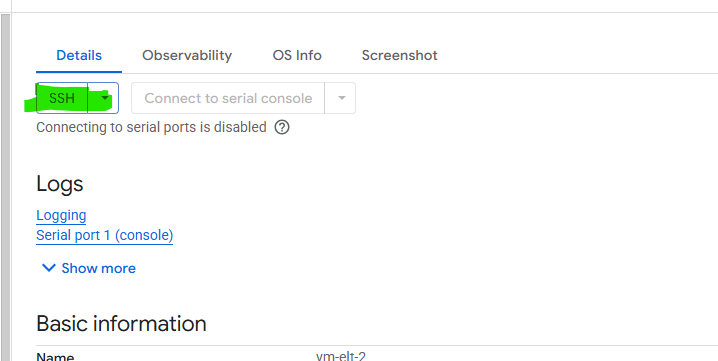

### 🔹 Step 14: Connect via SSH
Click **SSH** and authorize:  
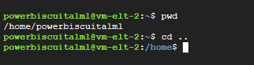

---

## 🗂️ File Upload & Environment Setup

### 🔹 Step 15: Create Project Directory
```bash
cd ~
mkdir biscuit
cd biscuit
```
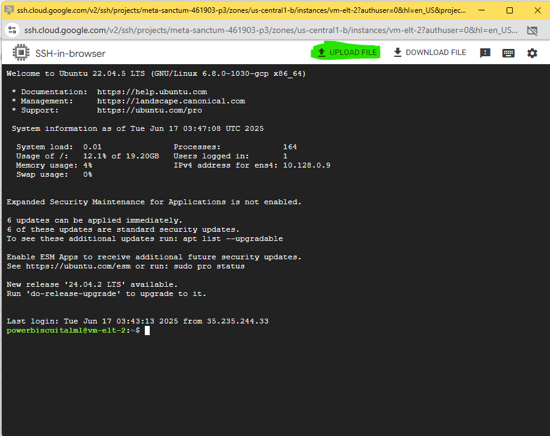

### 🔹 Step 16: Upload Files and Run Setup
Upload `environment.yml` and `setup.sh`. Then:
```bash
chmod +x setup.sh
./setup.sh
```
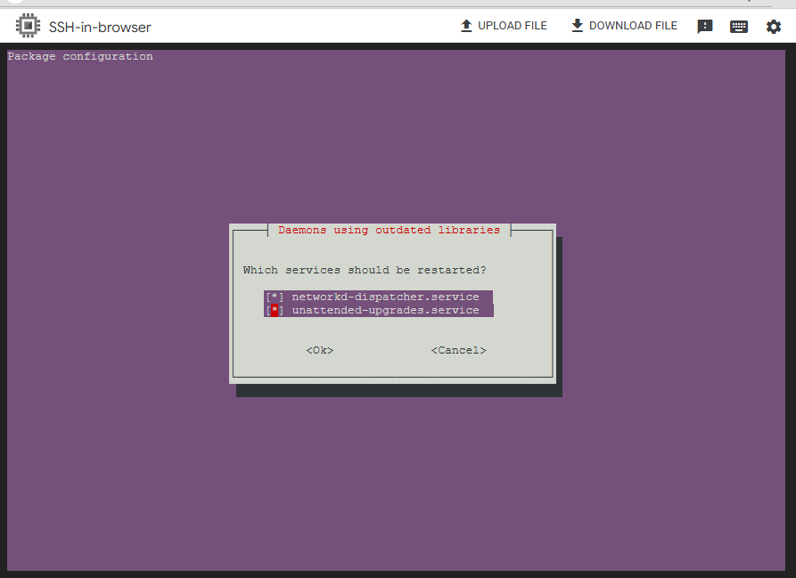

### 🔹 Step 17: Restart Services
Select both services to restart:  
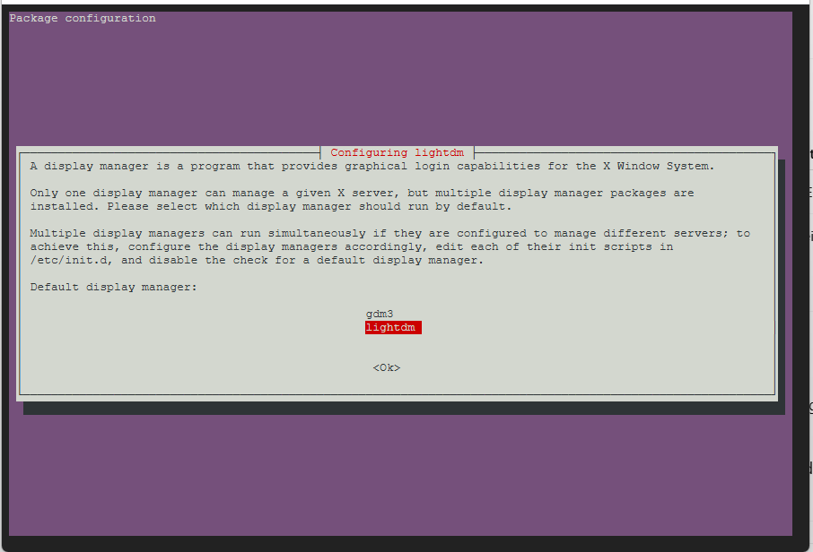

### 🔹 Step 18: Choose Desktop Environment
Select **lightdm** and reboot.

---

## 🐍 Python Environment & GitHub Setup

### 🔹 Step 19: Create Conda Environment
```bash
conda env create -f environment.yml
```

### 🔹 Step 20: Activate Conda Environment
```bash
conda activate <your_env_name>
```

### 🔹 Step 21: Generate SSH Key
```bash
ssh-keygen -t ed25519 -C "your_email@example.com"
```
Press Enter 3 times to accept defaults.  


### 🔹 Step 22: Copy Public Key to GitHub
```bash
cat ~/.ssh/id_rsa.pub
```
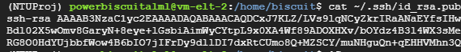  
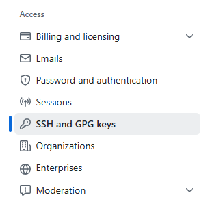


### 🔹 Step 23: Clone Repository
```bash
git clone <your-repo-url>
```

---

## 💻 Final Configuration

### 🔹 Step 24: Set User Password
```bash
sudo passwd $(whoami)
```
Use `whoami` to find your username:  
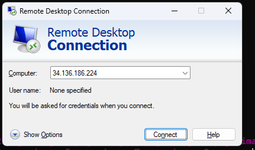

### 🔹 Step 25: Enable Desktop Environment
```bash
echo "startxfce4" > ~/.xsession
cat ~/.xsession
startxfce4
sudo systemctl restart xrdp
sudo reboot
```

### 🔹 Step 26: Upload Service Key
Download from BigQuery and upload your **service key** into your project directory.

### 🔹 Step 27: Navigate to Ingestion Directory
```bash
cd /home/biscuit/NTU-Project-Data-Science-AI/ingestion_pipe
```

---

## 🎯 Run Dagster and Access UI

### 🔹 Step 28: Start Dagster
```bash
dagster dev
```
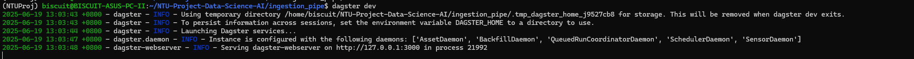

### 🔹 Step 29: Launch Windows RDP
Open Remote Desktop:  
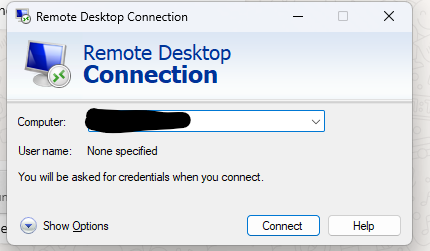

### 🔹 Step 30: Enter IP Address
Use the external IP address from your VM configuration.

### 🔹 Step 31: Login
Enter your **Linux VM** username and password.

### 🔹 Step 32: Open Dagster UI in Chrome
```text
http://127.0.0.1:3000/
```
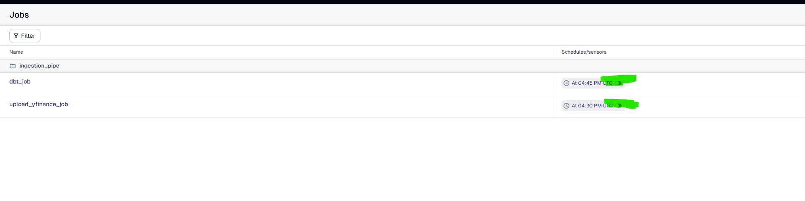

---

✅ You’re all set! Dagster, Python, and DBT should now be running in your configured GCP environment!
