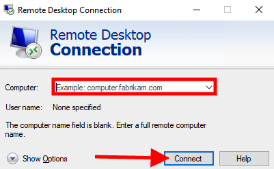

# Introduction
By Following the instructions stated below, users will be able to spin up an ec2 vm with 2 vCPUs , 10gb HDD and 4GB of ram which is useful for running Dagster, Python and DBT.After spinningup the VM please follow environment.md to create an environment for running the necessary libraries. Warning you will need to have an identical file base structure in order to minimize problems. The instructions writeen here are during creaation. 

Step1
In the search bar of the GCP Console, type Compute

Step 2 Select the Compute Engine

Step 3 You will arrive at the compute console

Step 4 Select the Google Cloud Console It is at the top right

Step 5 Cloud Shell Is launched

Step 7 Upload the "create-vm.sh" via the cloud console into the terminal. The file is located in IAC folder. See screen shot above.

Step 8 use the "ls" command to check if the file has been uploaded. The file should be in while colour. The file needs to made into an executable. See the image above

Step 9 Run the command  "chmod +x create-vm.sh" followed by the ls command . If run correctly the create-vm.sh will now be a green colour.See the image above.

Step 10 
run "./create-vm.sh" in the Cloud Shell.Ignore the disk size warning. There is no impact to the run speed.

Step 11 Click on the VM Instances to refresh the VM console. 

Step 12
You will now see virtual machine named vm-etl-2.

Step 13 -optional if you are not proceeding to install the environment. Click on the 3 dots and Click Stop VM. Failure to do so will incur running costs!.

Step 14- Click On the created VM as shown 

Step 15- Clock on the SSH Connection. When Prompted , Allow Authorization

Step 16- Check workign directory and use the cd command to goto the home directory. Use the command "mkdir biscuit" to create a new directory. cd into the newly created directory.

Step 16- Click on the upload files. Upload the "environment.yml" and the "setup.sh"  Copy it to the newly created biscuit directory. Make the script executable "chmod +x setup.sh" Run the script.

Step 17 Select Both Services to be restarted

Step 18 Choose lightdm. Follow the instructions on screen to reboot when done.

Step 19
Use the command "conda env create -f environment.yml" to install all the neccessary packages

Step 20
Activate the conda environment created

Step 21
a)Use the command below to create the ssh key to link to git hub
b)ssh-keygen -t ed25519 -C "your_email@example.com"
c)enter x 3 to accept the file location and to get teh defaults

Step 22
Run.
cat ~/.ssh/id_rsa.pub  Parts have been redacte. The key is quite long. Copy and paste this into Git hub.

Step 24
Git Clone the repo from Git Hub

Step 25
use the following command to create password
sudo passwd your user id

password does not show up

Use "whoami" to find your user name. You will need it for step 28

Step 26

Run this command to get your desktop running. Some instances may need this.
echo "startxfce4" > ~/.xsession
cat ~/.xsession
startxfce4
sudo systemctl restart xrdp
sudo reboot

Step 27
Down load the service key which you have already created and upload it to the Project folder that was created when the repo was cloned.

Step 28
cd into the ingestion directory
i.e
/home/biscuit/NTU-Project-Data-Science-AI/ingestion_pipe

Step 29
run the command "dagster dev"

Step 30 
Launch Windows RDP

Step 30 

Get the IP address from the VM configuration web page.
Enter it into the RDP

Step 31
Key in the Linux VM user ID and password

Step 32 
Launch Chrome and enter http://127.0.0.1:3000/  ( This is a typical url it may vary please check your command prompt)

Step 33
Click the job schedule to activate it.

